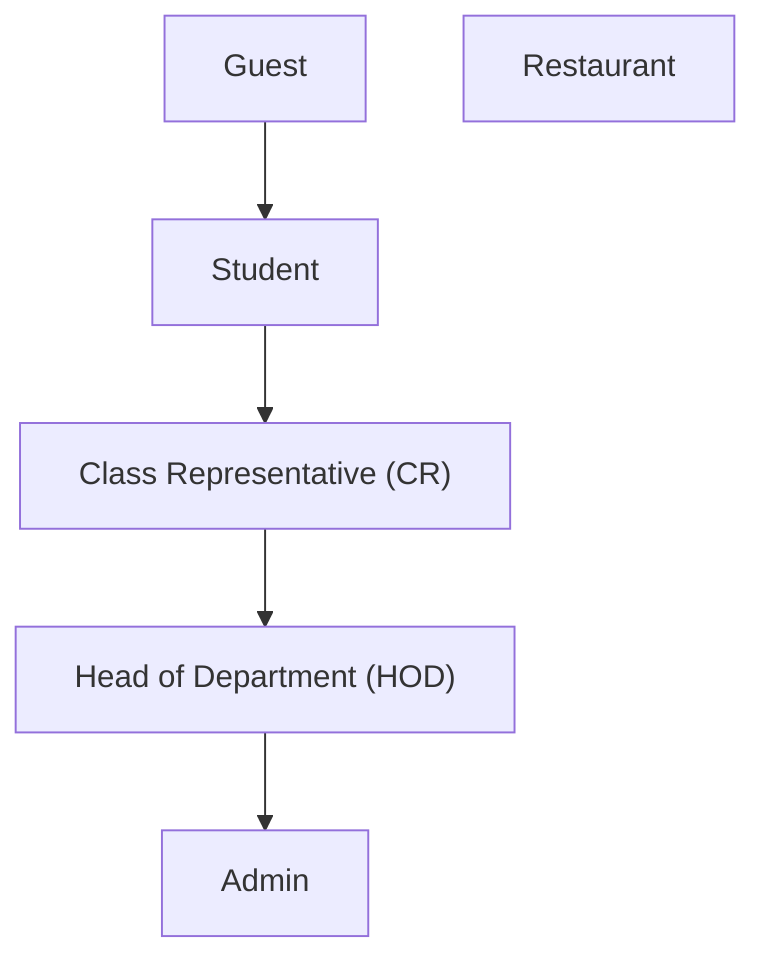

# Authentication Module

This module handles user authentication, registration, profile management, and password recovery.

## Legend

- ✅ = Authentication required
- ❌ = Public route (Guest only)

| Method | Endpoint | Description | Auth | Roles |
| :----: | -------- | ----------- | :--: | ----- |
|  | `/auth/student/register` | Display the student registration page. | ❌ | Guest |
|  | `/auth/student/register` | Register a new student account. | ❌ | Guest |
|  | `/auth/restaurant/register` | Display the restaurant registration page. | ❌ | Guest |
|  | `/auth/restaurant/register` | Register a new restaurant account. | ❌ | Guest |
|  | `/auth/login` | Display the login page. | ❌ | Guest |
|  | `/auth/login` | Authenticate the user and start a session. | ❌ | Guest |
|  | `/auth/logout` | End the current user session. | ✅ | Student, CR, Restaurant, HOD |
|  | `/auth/profile` | Display the authenticated user's profile. | ✅ | Student, CR, Restaurant, HOD |
|  | `/auth/change-password` | Display the change password page. | ✅ | Student, CR, Restaurant, HOD |
|  | `/auth/change-password` | Update the authenticated user's password. | ✅ | Student, CR, Restaurant, HOD |
|  | `/auth/forgot-password` | Display the password recovery page. | ❌ | Guest |
|  | `/auth/forgot-password` | Send a password reset OTP or reset link. | ❌ | Guest |
|  | `/auth/reset-password` | Display the password reset page. | ❌ | Guest |
|  | `/auth/reset-password` | Reset the password using a valid OTP or token. | ❌ | Guest |

---

# Authentication Module File Responsibilities
```text
app/auth/
├── README.md           # documentation
├── __init__.py         #
├── exceptions.py       # Custom exceptions
├── helpers.py          # Utility functions
├── models.py           # Database data models
├── queries.py          # SQL query storage
├── repository.py       # Database access layer
├── routes.py           # HTTP request/response handling
├── schemas.py          # Request and response schemas
└── service.py          # Business logic

1 directory, 10 files

```

## `routes.py`
- **Purpose:** HTTP request/response handling.
- **Responsibilities:**
  - Define Flask routes.
  - Receive HTTP requests.
  - Call schemas and services.
  - Render templates.
  - Return JSON responses or redirects.
- **Should NOT Contain:**
  - SQL queries.
  - Business logic.
  - Password hashing.
  - Validation logic.

## `service.py`
- **Purpose:** Business logic.
- **Responsibilities:**
  - Login and logout.
  - Student registration.
  - Restaurant registration.
  - Password change.
  - Forgot password.
  - Reset password.
  - OTP/token verification.
  - Coordinate repository and helper functions.
- **Should NOT Contain:**
  - Flask routes.
  - HTML rendering.
  - SQL queries.

## `repository.py`
- **Purpose:** Database access layer.
- **Responsibilities:**
  - Execute SQL queries.
  - Pass query parameters.
  - Map database rows to models.
  - Return dataclass objects.
- **Should NOT Contain:**
  - Business logic.
  - Flask code.
  - HTML rendering.

## `queries.py`
- **Purpose:** SQL query storage.
- **Responsibilities:**
  - Store `SELECT` statements.
  - Store `INSERT` statements.
  - Store `UPDATE` statements.
  - Store `DELETE` statements.
  - Store `JOIN` queries.
- **Should NOT Contain:**
  - Database execution code.
  - Business logic.

## `models.py`
- **Purpose:** Database data models.
- **Responsibilities:**
  - Define database entities using `@dataclass`.
  - Define joined query result models.
- **Should NOT Contain:**
  - SQL queries.
  - Validation logic.
  - Business logic.

## `schemas.py`
- **Purpose:** Request and response schemas.
- **Responsibilities:**
  - Validate user input.
  - Define request models.
  - Define response models.
  - Handle serialization/deserialization.
- **Should NOT Contain:**
  - SQL queries.
  - Database access.
  - Business logic.

## `helpers.py`
- **Purpose:** Utility functions.
- **Responsibilities:**
  - Password hashing.
  - Password verification.
  - OTP generation.
  - Token generation.
  - Email helper functions.
  - Session helper functions.
  - Decorators.
  - Reusable utility functions.
- **Should NOT Contain:**
  - SQL queries.
  - Route handlers.
  - Business workflows.

## `exceptions.py`
- **Purpose:** Custom exceptions.
- **Responsibilities:**
  - Define authentication exceptions.
  - Define authorization exceptions.
  - Define validation exceptions.
  - Define application-specific exceptions.
- **Should NOT Contain:**
  - SQL queries.
  - Business logic.
  - Route handling.

## `__init__.py`
- **Purpose:** Package initialization.
- **Responsibilities:**
  - Initialize the package.
  - Export commonly used objects if needed.
- **Should NOT Contain:**
  - Business logic.
  - SQL queries.
  - Route definitions.

## `README.md`
- **Purpose:** Module documentation.
- **Responsibilities:**
  - Describe the module.
  - Document routes.
  - Explain the architecture.
  - Show the folder structure.
  - Provide usage instructions.
- **Should NOT Contain:**
  - Executable application code.

---

# Data Flow

1. Client sends a request.
2. `routes.py` receives the request.
3. `schemas.py` validates the input.
4. `service.py` applies business rules.
5. `repository.py` executes database operations.
6. `queries.py` provides the SQL statements.
7. Database returns data.
8. `repository.py` converts database rows into models from "models.py".
9. `service.py` processes the result.
10. `routes.py` returns the response to the client.

---

# Authentication

The Authentication module is responsible for user identity management, account lifecycle, and access control. It provides secure mechanisms for registration, authentication, password management, and role-based authorization.

## Responsibilities

- User registration
- User authentication (Login/Logout)
- Password hashing and verification
- Password reset and recovery
- OTP verification
- Token generation and validation
- Profile management
- Session management
- Role-based access control (RBAC)

---

# Exceptions

The module defines custom exceptions to represent authentication, authorization, and account-related business errors. These exceptions enable the service layer to communicate meaningful failures while keeping database and HTTP implementation details separate.

## Exception Hierarchy

```text
app.auth.exceptions
ConflictException
├── UserAlreadyExistsException
│   ├── EmailAlreadyExistsException
│   └── PhoneAlreadyExistsException
├── PasswordMismatchException
└── PasswordReuseException

NotFoundException
└── UserNotFoundException

UnauthorizedException
├── InvalidCredentialsException
├── AccountNotVerifiedException
├── InvalidOtpException
├── OtpExpiredException
├── InvalidTokenException
└── TokenExpiredException

ForbiddenException
├── PermissionDeniedException
├── InsufficientPrivilegesException
├── AccountDisabledException
└── AccountLockedException
```

## Exception Reference

| Exception | Description |
|-----------|-------------|
| `UserAlreadyExistsException` | Base exception raised when a user already exists. |
| `EmailAlreadyExistsException` | Raised when the supplied email address is already registered. |
| `PhoneAlreadyExistsException` | Raised when the supplied phone number is already registered. |
| `UserNotFoundException` | Raised when the requested user cannot be found. |
| `InvalidCredentialsException` | Raised when authentication fails because the provided credentials are invalid. |
| `AccountNotVerifiedException` | Raised when a user attempts to authenticate before verifying their account. |
| `AccountDisabledException` | Raised when an account has been disabled by an administrator. |
| `AccountLockedException` | Raised when an account is temporarily locked due to security policies. |
| `InvalidOtpException` | Raised when an invalid one-time password (OTP) is provided. |
| `OtpExpiredException` | Raised when the submitted OTP has expired. |
| `InvalidTokenException` | Raised when an authentication or password reset token is invalid or malformed. |
| `TokenExpiredException` | Raised when an authentication or password reset token has expired. |
| `PasswordMismatchException` | Raised when the new password and its confirmation do not match. |
| `PasswordReuseException` | Raised when the new password matches a previously used password. |
| `PermissionDeniedException` | Raised when an authenticated user attempts an action they are not permitted to perform. |
| `InsufficientPrivilegesException` | Raised when the user's role or privileges are insufficient to perform the requested operation. |
---

# Role-Based Access Control (RBAC)

The application implements Role-Based Access Control (RBAC) to ensure that users can access only the resources and operations permitted by their assigned role.

## Role Hierarchy



> **Note**
>
> The **Restaurant** role is independent of the academic hierarchy. It manages food items and customer orders but has no administrative authority over students, CRs, HODs, or other academic resources.

## Role Definitions

### Guest

An unauthenticated visitor.

**Permissions**

- Browse restaurants.
- Search food items.
- View menus.
- Add or remove items from the shopping cart.
- Register a student account.
- Register a restaurant account.
- Login.
- Request password recovery.

---

### Student

An authenticated student.

**Permissions**

- All Guest permissions.
- Place food orders.
- View personal order history.
- Cancel eligible orders.
- Manage personal profile.
- Change password.
- Logout.

---

### Class Representative (CR)

A student assigned to represent a section.

**Additional Permissions**

- View the total number of orders placed by students in their assigned section.
- View section-level order statistics.
- Temporarily activate or deactivate students within their assigned section.

---

### Head of Department (HOD)

Department administrator.

**Additional Permissions**

- Create, update, and manage sections.
- Assign or remove Class Representatives.
- View department-wide order statistics.
- View total orders and total items ordered within the department.
- Manage department profile.

---

### Restaurant

Restaurant owner or manager.

**Permissions**

- Manage restaurant profile.
- Add menu items.
- Update menu items.
- Delete menu items.
- Manage menu availability.
- Receive customer orders.
- Accept or reject orders.
- Update order status.
- View restaurant order history.

---

### Administrator

System administrator.

**Permissions**

- Full system access.
- Manage all users.
- Manage restaurants.
- Manage departments and sections.
- Assign or revoke user roles.
- Activate or deactivate any account.
- View all orders and reports.
- Configure system settings.
- Audit system activities.

---

## Permission Matrix

| Permission | Guest | Student | CR | HOD | Restaurant | Admin |
|------------|:-----:|:-------:|:--:|:---:|:----------:|:-----:|
| Browse restaurants | ✅ | ✅ | ✅ | ✅ | ❌ | ✅ |
| Search food | ✅ | ✅ | ✅ | ✅ | ❌ | ✅ |
| Manage shopping cart | ✅ | ✅ | ✅ | ✅ | ❌ | ✅ |
| Place orders | ❌ | ✅ | ✅ | ✅ | ❌ | ✅ |
| View personal orders | ❌ | ✅ | ✅ | ✅ | ❌ | ✅ |
| Manage profile | ❌ | ✅ | ✅ | ✅ | ✅ | ✅ |
| View section statistics | ❌ | ❌ | ✅ | ✅ | ❌ | ✅ |
| Manage students in section | ❌ | ❌ | ✅ | ✅ | ❌ | ✅ |
| Manage sections | ❌ | ❌ | ❌ | ✅ | ❌ | ✅ |
| Assign or remove CR | ❌ | ❌ | ❌ | ✅ | ❌ | ✅ |
| Manage restaurant menu | ❌ | ❌ | ❌ | ❌ | ✅ | ✅ |
| Process restaurant orders | ❌ | ❌ | ❌ | ❌ | ✅ | ✅ |
| Manage all users | ❌ | ❌ | ❌ | ❌ | ❌ | ✅ |
| Configure system settings | ❌ | ❌ | ❌ | ❌ | ❌ | ✅ |