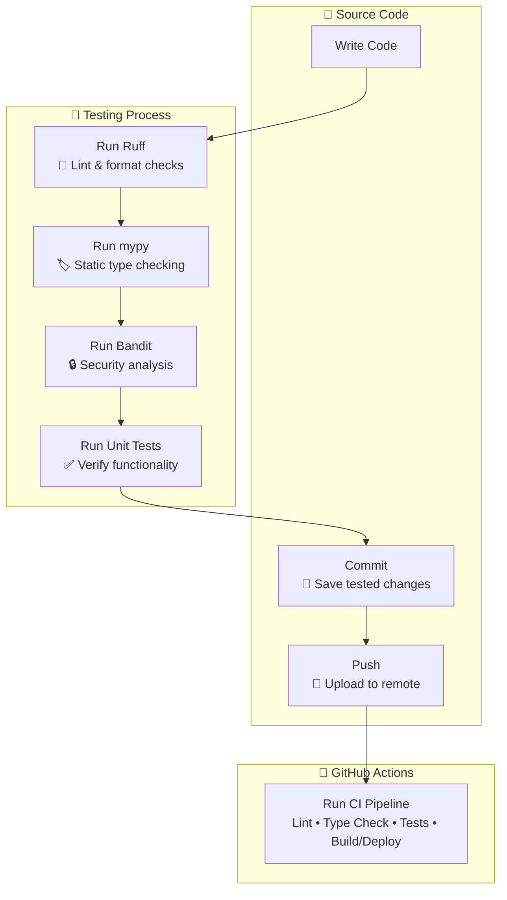

# 🧪 Testing Guide

---

# 📊 Testing Roadmap

| Testing Type | Status | Description |
|:-------------|:------:|:------------|
| 🔍 [Static Analysis](#static-analysis) | ✅ Implemented | Analyze source code without execution |
| 🧩 [Unit Testing](#unit-testing) | ✅ Implemented | Test individual functions and classes |
| 🔗 [Integration Testing](#integration-testing) | ⏳ Planned | Test interaction between components |
| 🌐 [API Testing](#api-testing) | ⏳ Planned | Validate HTTP endpoints |
| 🎭 [End-to-End Testing](#end-to-end-testing) | ⏳ Planned | Simulate complete user workflows |
| 🔐 [Security Testing](#security-testing) | ⏳ Planned | Detect security vulnerabilities |
| ⚡ [Performance Testing](#performance-testing) | ⏳ Planned | Load, stress and benchmark testing |
| 🌍 [Compatibility Testing](#compatibility-testing) | ⏳ Planned | Browser and platform compatibility |

---

# 🔍 Static Analysis

> **Purpose**
>
> Analyze source code **without executing it** to detect issues early during development.

---

## ✔ What It Detects

- Syntax errors
- Unused imports
- Unused variables
- Dead code
- Code style violations
- Type inconsistencies
- Possible runtime bugs
- Security issues
- High code complexity
- Dangerous programming patterns

---

## 🛠 Tools

### Ruff

Fast all-in-one linter.

Features:

- Linting
- Formatting
- Import sorting
- Code quality checks

Replaces:

- flake8
- isort
- pycodestyle

---

### mypy

Static type checker.

Detects:

- Invalid type assignments
- Incorrect function arguments
- Missing return types
- Type inconsistencies

---

### Bandit

Security-focused static analyzer.

Detects:

- Hardcoded secrets
- Unsafe `eval()`
- Weak cryptography
- SQL injection patterns
- Insecure file operations

---

### pip-audit

Checks installed dependencies against known security vulnerabilities.

---

## ▶ Running Static Analysis

```bash
ruff check .
ruff format .
mypy .
bandit -r .
pip-audit
```

---

# 🧩 Unit Testing

> **Purpose**
>
> Verify that individual functions, methods and classes behave correctly in complete isolation.

---

## ✔ Characteristics

- Tests one unit at a time
- Fast execution
- Independent
- Deterministic
- No external services
- No database dependency
- No network requests

---

## 📁 Directory Structure

```text
tests/
├── README.md
├── e2e
├── integration
├── performance
├── security
└── unit
    ├── auth
    ├── core
    ├── users
    └── ...
```

---

## ▶ Running Unit Tests

Run all unit tests

```bash
python -m pytest tests/unit
```

Run a single file

```bash
python -m pytest tests/unit/core/test_schemas.py
```

Run a single test

```bash
python -m pytest tests/unit/core/test_schemas.py::test_success_response
```

---

# 🚧 Planned Testing

The following testing layers are **not yet implemented**.

## 🔗 Integration Testing

> [!NOTE]
> **Status:** ⏳Planned


Will verify:

- Database interaction
- Repository layer
- Service layer
- External services

---

## 🌐 API Testing

> [!NOTE]
> **Status:** ⏳Planned

Will verify:

- HTTP status codes
- Response body
- Response schema
- Headers
- Authentication
- Authorization

---

## 🎭 End-to-End Testing

> [!NOTE]
> **Status:** ⏳Planned


Will verify complete user journeys, including:

- Registration
- Login
- Cart
- Checkout
- Order placement

---

## 🔐 Security Testing

> [!NOTE]
> **Status:** ⏳Planned


Will include:

- Authentication testing
- Authorization testing
- Injection attacks
- Dependency scanning
- JWT validation

---

## ⚡ Performance Testing

Status: ⏳ Planned

Will include:

- Load testing
- Stress testing
- Benchmark testing

---

## 🌍 Compatibility Testing

> [!NOTE]
> **Status:** ⏳Planned


Will verify compatibility across:

- Browsers
- Operating systems
- Mobile devices

---

# 🚀 Continuous Integration

Every pull request should execute:

```text
✓ Ruff
✓ mypy
✓ Bandit
✓ pip-audit
✓ Unit Tests
```

Future CI pipeline will additionally include:

```text
○ Integration Tests
○ API Tests
○ Security Tests
○ E2E Tests
○ Performance Tests
```

---

# 📌 Development Workflow

